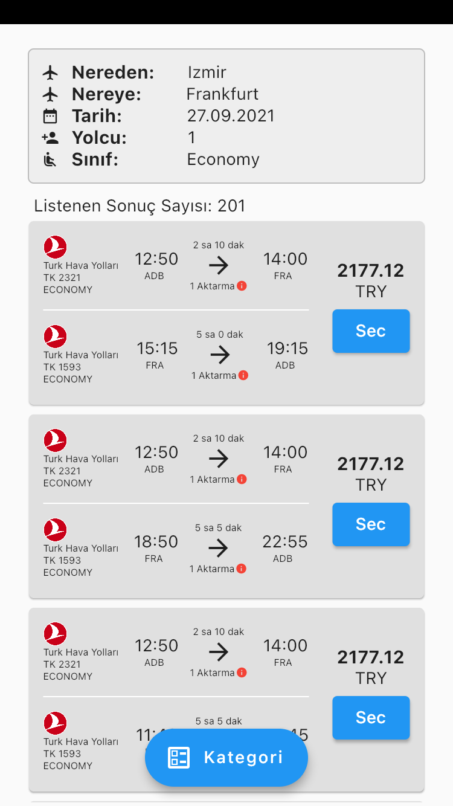
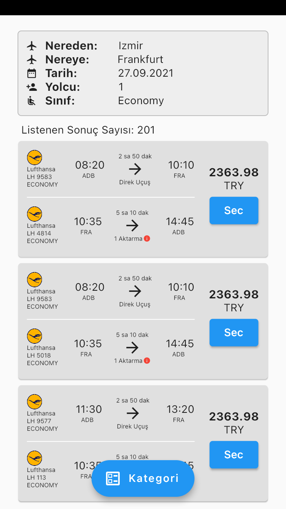
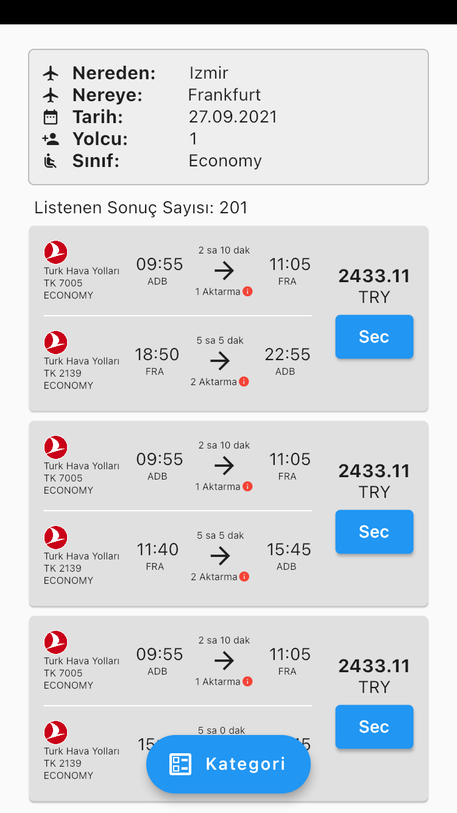
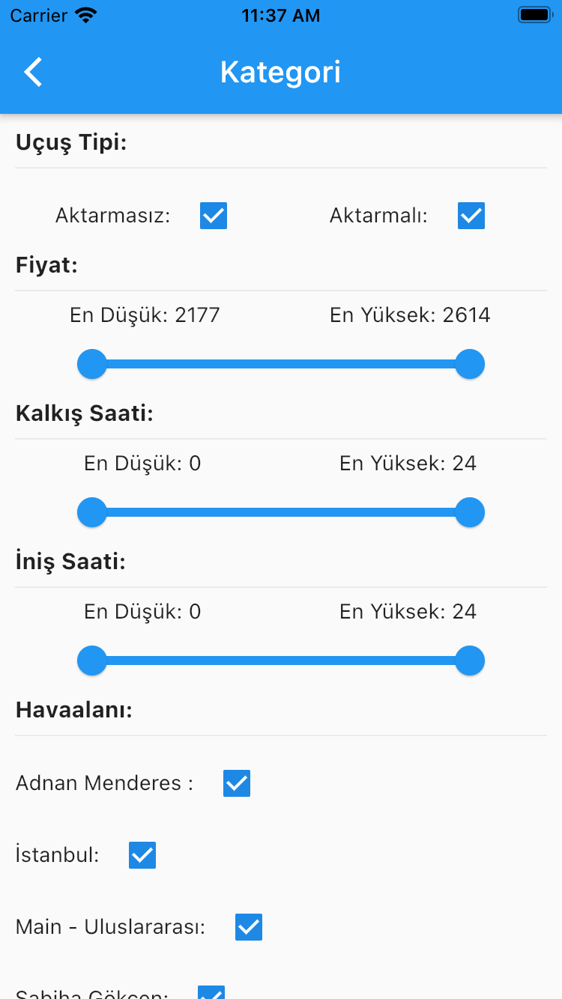
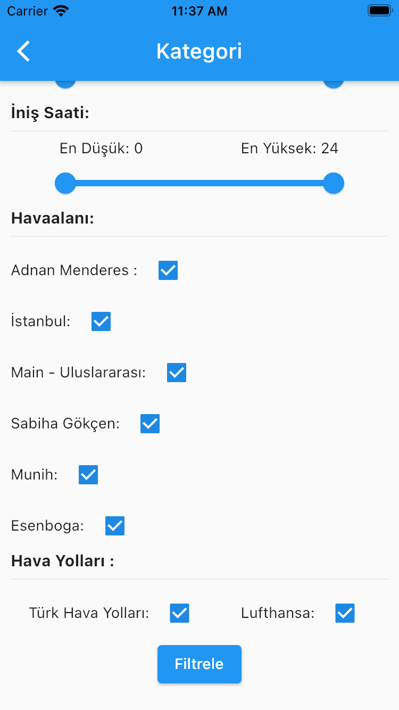
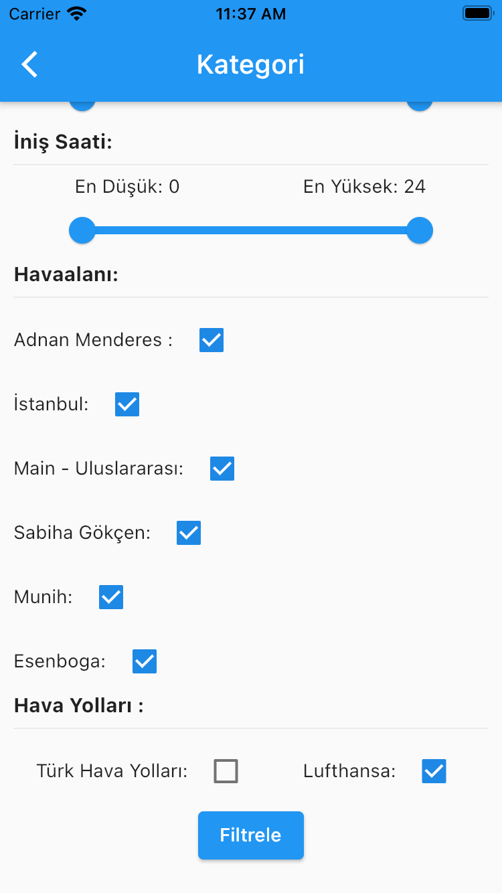
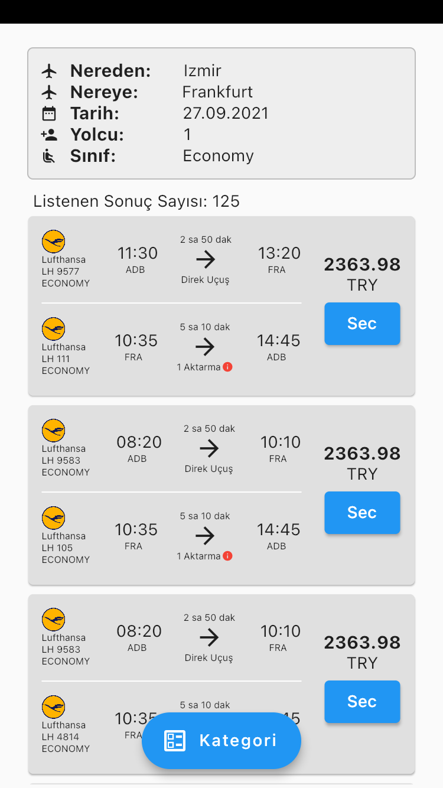
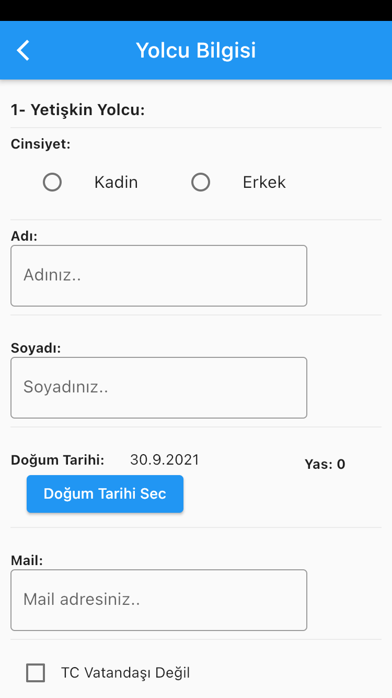
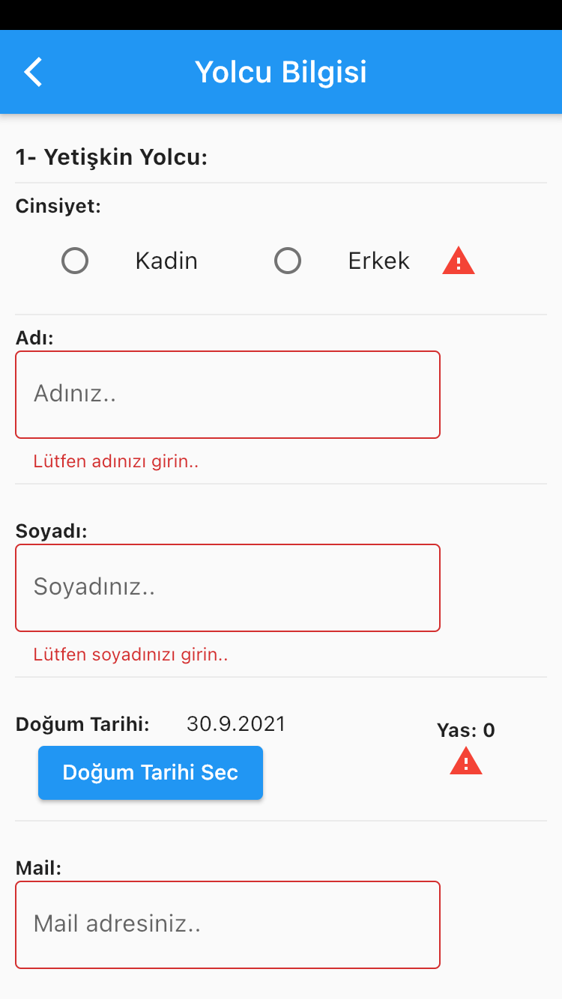

# FindFlight App

findflight App, flutter ile yazılmıştır. 2,5mb boyutunda ve toplamda 66bin satır içeren tek parça json dosyasının parse edilmesi ve elde edilen 201 adet uçuş bilgisinin filtrelenerek tekrar listelenmesi amaçlanmıştır.

   

# Library | Use
provider: ^6.0.0
 http: ^0.13.3
 email_validator: ^2.0.1

# How to
Uygulama için öncelikle json dosyasına göre modeller oluşturulmuş ve parse işlemi tamamlanmıştır.
Ardından ekran tasarımlarına geçilmiş ve ilk ekran oluşturulmuştur. Uygulama; nereden nereye, tarih ve benzeri uçuş bilgilerinin görüntülendiği ekranla açılmaktadır. Hemen altında ki sonuçları görüntüle butonuna bastığımızda json dosyasından parse edilen bilgiler uçuş bilgi card'ları olarak 201 adet görüntülenmekedir. 
Ardından filtreleme sayfasına geçilerek, aktarma / aktarmasız, fiyat aralığı, kalkış saat aralığı, iniş saat aralığı, uçuşların bağlı olduğu havaalanları ve havayolu firma seçimi şeklinde sonuçlar filtrelenerek listelenmektedir.
Validasyon ekranında ise veri girişine uygun olarak tek bir form yapısı latında validasyonlar sağlanmaktadır. Ayrıca yaş kontrolü yapılarak yetişkin bireyler için 12 yaş sınırı belirlenmiş olup 12 yaşın altında olan doğum tarihi seçimi yapılmasına izin verilmemiştir.

   

 Validasyon Ekranı:
  

  FindFlight App - Video @Youtube: 
 
 

 - Uygulama tasarımında, arayüz ve kullanıcı deneyimi dikkate alınmamıştır. 
 - Uygulama, Iphone SE (2nd Generation) emülatörü üzerinde test edilerek geliştirilmiştir.
 - Uygulama ekran görüntülerine ve video içeriklerine media klasöründen ulaşılabilir.
